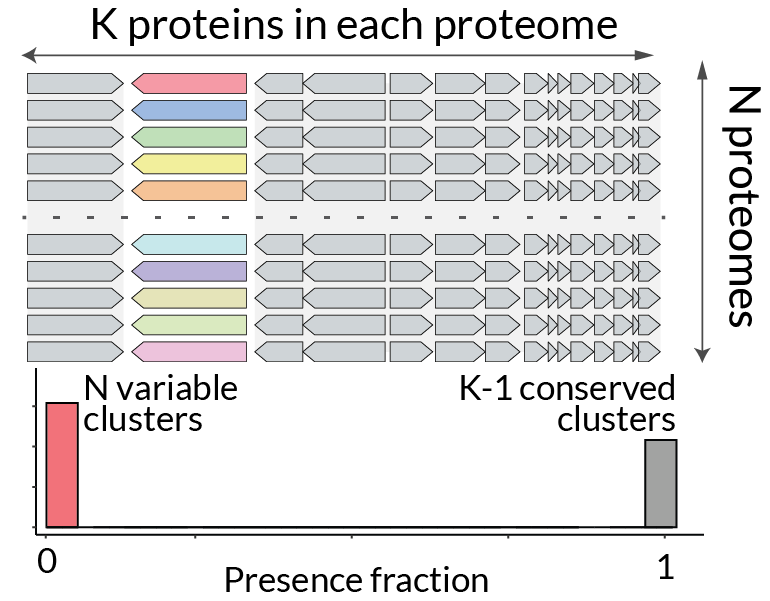
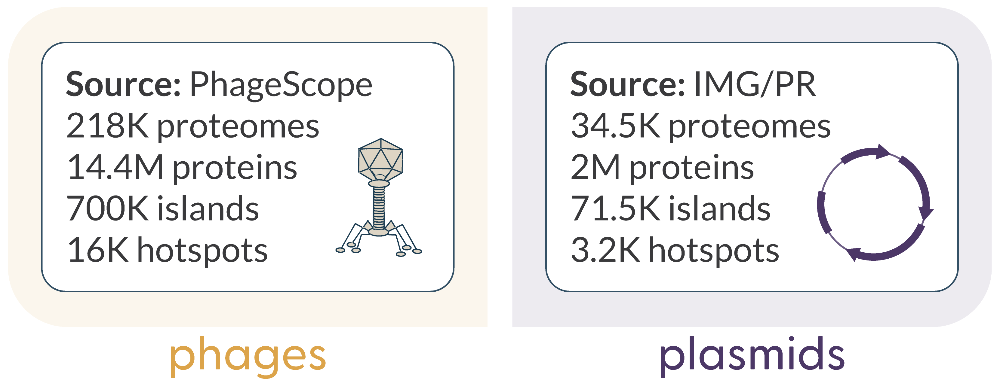

# Algorithm description

Here we describe in details each step of the iLund4u workflow, which schematically is shown on the Figure 1. For description of generated files, visualisation, and frequently used parameters, see the [Example-driven guide page](https://art-egorov.github.io/ilund4u/ExampleDrivenGuide/cmd_guide/). 


<figure markdown="span" style="align:center; margin-top: 0; margin-bottom: 0;">
	{ width="100%" loading=lazy }  
	<figcaption style="margin-top: 0; margin-bottom: 0;">Figure 1. iLund4u workflow.</figcaption>
</figure>

## Hotspot annotation mode

### Defining groups of protein homologues and proteome filtering

The first step is reading input data in gff format with the [BCBio-gff](https://github.com/chapmanb/bcbb/tree/master/gff) library. While reading the files, we store all encoded protein sequences in a fasta file, which will be used as input for MMseqs clustering. In iLund4u objects we do not store sequences. Instead, iLund4u objects hold links to the corresponding files (a gff file for proteomes and the fasta file with amino acid sequences), which helps to avoid large memory usage.  
This step includes the initial filtering round, based on proteome size. By default, we do not take for proteomes analysis if they have fewer than 15 proteins ($N_{CDSs} < 15$).The minimal proteome size can be changed with `-mps, --min-proteome-size <int>` parameter or the config parameter *min_proteome_size*. 

After gff files are read, we use the [MMseqs2](https://github.com/soedinglab/mmseqs2) clustering pipeline with all encoded proteins as input. All the clustering parameters can be adjusted using the configuration file (see [Parameters](https://art-egorov.github.io/ilund4u/Parameters/cmd_parameters/) section). By default, we use the following parameters: `--cluster mode 0 --cov-mode 0 --min-seq-id 0.25 -c 0.8 -s 7` (see [mmseqs documentation](https://mmseqs.com/latest/userguide.pdf) for a detailed description).

We then treat each cluster of proteins as *a group of homologues*. For each group we set the identifier (id) attribute as the id of the representative protein for the cluster.

While processing the MMseqs results we iterate over all proteomes and all encoded proteins of each proteome, setting the attribute ”group” for each CDS as id of cluster it belongs to. At this step we also perform deduplication; if during iteration we find a proteome in which the same full list of identified protein groups encoded in the same order along the genome has already been seen in a previously processed proteome - then this proteome will be excluded from the analysis. That is, we do not use multiple proteomes with identical proteome compositions in terms of groups of homologues and their genomic locations. This is in order to reduce redundancy and make it possible to find variable genes and hotspots. All filtered data and reasons for filtering are recorded in results file *dropped_sequences.tsv*. A second filtering process at this step is exclusion of proteomes for which proteome composition uniqueness (in the same assembly) is less than a set cutoff [default: 0.7] (this can be changed in the config file with the proteome_uniqueness_cutoff parameter). This is to exclude cases where large and potentially artifactual DNA duplications appear in the assembly. Proteome uniqueness is defined as: $pu_{i} = {|G_i|}/{N_i}$, where $|G_i|$ is the length (number of unique elements) of the set of protein groups of $i^{th}$ proteome, and $N_i$ - the number of CDSs of $i^{th}$ proteome. 

### Proteome network construction

The second major step is building the network of proteomes. The idea is to construct a weighted graph where each node, say $n_i$, represents the corresponding $i^{th}$ proteome. Each graph edge, say $e_{ij}$, connecting $i^{th}$ and $j^{th}$ proteomes has weight $w_{ij}:$
$$
w_{ij} = (\frac{\vert G_i \cap G_j \vert}{\vert G_i \vert} + \frac{\vert G_i \cap G_j|}{|G_j|})\cdot\frac{1}{2} = \frac{|G_i \cap G_j|\cdot(|G_i|+|G_j|)}{2|G_i||G_j|}; \,\, w_{ij}\in[0,1]; \, \, w_{ij} = w_{ji} \,\, \forall\,i,j
$$ 
where $|G_i|$, $|G_j|$ are lengths (number of unique elements) of the sets of protein groups of $i^{th}$ and $j^{th}$ proteomes, respectively. $|G_i \cap G_j|$ is the number of shared (overlapped) protein groups between $i^{th}$ and $j^{th}$ proteomes.  
The meaning of $w_{ij}$ is average value of two fractions: the first $|G_i \cap G_j|/|G_i|$ is the number of shared homologues normalised to the length of $i^{th}$ proteome set of protein groups, and the second $|G_i \cap G_j|/|G_j|$ - the same number of shared homologues with normalisation to the $j^{th}$ proteome. The average of the two normalisations gives the required symmetric property with respect to its indexes. That is, $w_{ij}$ is a metric of similarity of two genomes in terms of their proteome composition.

While building the graph we write only edges where the weight passes the cutoff, which is by default $w_{ij}\geq 0.7$. The cutoff can be changed with the config parameter proteome_similarity_cutoff. This not only reduces memory usage for a large set of input data but also allows us to skip calculation of those $w_{ij}$ if for the corresponding $i^{th}$ and $j^{th}$ proteomes we have $|G_j| > |G_i|/0.7$. In other words, if we cannot reach weight 0.7 due to the proteome size difference we do not start its calculation.  
This is implemented in the algorithm as follows: we first sort all proteomes by length of the protein group set. Then for each unique length value $l$ we calculate the upper length cutoff  $L^u(l)$: $L^u(l)=l/0.7$. This allows us to limit the set of potential network connection indexes $c_i$ for $i^{th}$ proteome, which we need to calculate, from $i < c_i$ to $i < c_i < U(L^u(|G_i|))$, where $U(L^u(|G_i|))$ is the first index U of a proteome in which the set length is $|G_U| = L^u(|G_i|)$.  

Below we show the python-like pseudocode of the proteome network construction function. 

???+ card_heart_cog "**Network construction python-like pseudocode**" 
	```python linenums="1"
	# Initialise the dictionary with the following structure: key - protein group of homologues (str),
	# value - list of proteomes where it is encoded (as collections.deque object) 
	protein_group_to_proteome_index = {
	    "protein_group_1": [ind1_1, ind1_2, ind1_3, ...],
	    "protein_group_2": [ind2_1, ...], ... }
	# Initialise the dictionary of upper index cutoffs:
	# key - size of protein group set (int), value - upper proteome index cutoff (int)
	upper_index_cutoff = {
	    "protein_group_set_size_1": upper_proteome_index_cutoff1, ... }
	# Create a graph object to represent the proteome network
	proteome_network = GraphObject()
	# Iterate over each proteome index
	for i in indexes_of_proteomes:
	    # Initialise a dictionary to count number of shared homologues
	    counts_i = collections.defaultdict(int)
	    # Iterate over each protein group in the ith proteome
	    for protein_group in ith_proteome_protein_groups:
 	       # Iterate over each proteome index associated with the current protein group
	        for j in protein_group_to_proteome_index[protein_group].copy():
	            # Retrieve the upper limit for the current proteome size
	            upper_limit = upper_index_cutoff[ith_proteome_size]
	            # Check if the current index j is within the acceptable range
	            if i < j < upper_limit:
	                counts_i[j] += 1
	            elif j <= i:
	                # Remove j from the upper index cutoff if it is less than or equal to i
	                upper_index_cutoff[ith_proteome_size].popleft()
	            else:
	                # Exit the loop if j exceeds the upper limit
	                break    
	    # Normalise the counts to get the weights
	    weights_i = normalise(counts_i)
	    # Update the proteome network with new weights
	    proteome_network.update(weights_i)		
	```

The complexity of the network construction step is $O(N_p\cdot\bar{|G|}\cdot\bar{P})$, where $N_p$ is the number of proteomes, $\bar{|G|}$ is the average proteome size, and $\bar{P}$ is the average size of protein group homologues (in how many proteomes its members are encoded). In general, it equals to the sum of shared homologues between proteomes that can be connected. 
 
In our tests, the elapsed times for the network building function on different architectures are as follows:  
i) 70 seconds for 20K Enterobacteria phage proteomes on M1 MacBook Pro laptop;  
ii) 500 seconds (8.4 minutes) for 222K plasmid proteomes on AMD 7413 (2.65 Ghz) computing node;    
iii) 3610 seconds (60 minutes) for 563K phage proteomes on AMD 7413 (2.65 Ghz) computing node.  
The relatively large difference between the phage and plasmid proteome processing steps is due to the much higher density of the phage network (22M vs 860K written edges).

### Proteome community detection
 
Once the network is constructed, the next step is to define communities of proteomes to reveal the substructure of more and less closely related proteomes within the network. For this task we use the Leiden algorithm (*[Traag Vincent A et al, Scientific reports (2019)](https://doi.org/10.1038/s41598-019-41695-z)*) of [leidenalg python library](https://leidenalg.readthedocs.io/en/stable/index.html) implementation with the quality function based on the Constant Potts Model (CPM):  
$Q =  \sum_{c}{e_c - \gamma \binom{n_c}{2}}$, where $e_c$ is the weighted number of edges inside community $c$, $n_c$ is the number of nodes in community $c$, and $\gamma$ is the resolution parameter, which can be interpreted as the inner and outer edge density threshold (see *[Traag Vincent A. et al Physical Review E—Statistical, Nonlinear, and Soft Matter Physics 2011](https://doi.org/10.1103/PhysRevE.84.016114)*). By default the resolution parameter is set as: $\gamma = 0.5$ and can be changed with the *leiden_resolution_parameter_p* config argument.

We treat each proteome community as a group of relatively more closely related proteomes, which we can use for our subsequent analyses.

### Defining protein group classes 

Within each proteome community we can find homologous protein groups that are encoded in different fractions of the proteomes. Those that are found in the majority of proteomes we call *“conserved”* (equivalent to “core” in pan-genome analyses). Those protein groups that are found in a relatively small fraction of proteomes then we call *“variable”* (equivalent to “cloud” in pan-genome analyses). Finally, those protein groups that are neither very variable nor very conserved, we refer to as *“intermediate”*  (“shell” in pan-genome analyses).

<figure markdown="span" style="float: right; margin: 0; padding: 0;">
{align=right loading=lazy width="300" margin="0" padding="0"}  
<figcaption style="width: 100; margin: 0; padding: 0;">Figure 2</figcaption>
</figure>


For each protein group $g_i$ within a proteome community $c$ that consists of $N_c$ proteomes, we the define protein group presence fraction as $f_i =  N_c^{g_i}/N_c$, where $N_c^{g_i}$ is the number of proteomes of $c$ community that contain the $g_i$ protein group. if $f_i < 0.25$ $g_i$ group class is set as *"variable"*, if $ 0.25 \leq f_i \leq 0.75$ then $g_i$ is *"intermediate"*, and, if $ f_i > 0.75 $ we say that $g_i$ is *"conserved"*. 

The number of *"conserved"* protein groups  $G_c^{con}$ of any community, say community $c$, will be proportional to the average proteome size $\overline{|G|}_c$ of community members, while the number of *"variable"* protein groups $G_c^{var}$ will be proportional to the $N_c$ - community size (number of proteomes). That is, $G_c^{con} \propto \overline{|G|}_c$ and $G_c^{var} \propto N_c$.  

See the trivial example illustration on Figure 2 with the distribution of protein classes for a proteome community with all proteomes having $K$ proteins, $K-1$ being a member of the *"conserved"* protein class with $f = 1$ and $1$ unique protein class per each proteome with $f = 1/N$. 

### Annotation of variable islands 

After assigning the protein group class to each protein within each proteome community, we can now define *”variable island”* objects. We say that a variable island is a region containing a set of adjacent and non-conserved proteins with at least one protein being “variable”. The minimal size of an island is one protein (and it should be “variable”) while no upper limit is set. In other words, a *”variable island”* is a locus of “variable” protein(s) without internal interruption by “conserved” ORFs but possibly containing “intermediate” proteins.

Here it is important to note that the annotation process also depends on the “circularity” property of a query genome. If a genome is circular then the first and the last genes will be considered to be neighbours. By default we consider each genome as circular, which can be changed with the `-ncg, --non-circular-genomes` parameter. Additionally, the circularity property of each genome can be set independently with `-gct, --genome-circularity-table <path>` (see the [Parameters sections](https://art-egorov.github.io/ilund4u/Parameters/cmd_parameters/) for details). 

In addition, if a genome is not considered circular, islands located at the ends of sequences (flanked from only one side) will not be considered in clustering to hotspots by default in the next steps (even though will be reported in accumulated statistics about all islands). This is the standard iLund4u behaviour. However, you can force to consider them by using the `-rnf, --report-not-flanked` parameter.

The most important island attribute that defines all subsequent steps is a set of its conserved flanking protein groups. When a *variable island* region is defined we iterate over its flanking proteins encoded on both sides. Over iteration we add each “conserved” protein to the attribute of conserved neighbours (either left or right). The iteration on each side stops either when five neighbours (adjustable with *neighbours_one_side_max_size* config parameter) are collected on each side or when we pass over eight neighbour proteins (*neighbours_max_distance* config parameter). The minimal number of collected “conserved” neighbours is set by default as five (*neighbours_min_size* config parameter) and if an island does not reach the total number of five “conserved” neighbours it will not be taken in subsequent steps. The limit on distance from the island is set to avoid cases where an island has only a few “conserved” proteins in flanking genes and the whole locus around consists of variable proteins, which will not allow us to analyse it as a hotspot.


### Island network construction and hotspot annotation

A hotspot is a set of *variable islands* encoded in different genomes, but in the same locus. This is, they have similar “conserved” flanking genes. From this definition we can consider each variable island as a locus characterised by its “conserved” neighbours (more precisely by the set of protein groups of its “conserved” neighbours) and build a network of islands where each node, say, $n_i^c$, represents the corresponding $i^{th}$ *variable island* in proteome community $c$ and each edge, say $e_{ij}^c$, connecting $i^{th}$ and $j^{th}$ *variable islands* has weight $w_{ij}^c$:  
$$
w_{ij}^{c} = \frac{|G_{ic} \cap G_{jc}|\cdot(|G_{ic}|+|G_{jc}|)}{2|G_{ic}||G_{jc}|}
$$
where $|G_{ic}|$, $|G_{jc}|$ are lengths (number of unique elements) of the sets of protein groups of $i^{th}$ and $j^{th}$ island "conserved" neighbours, respectively. $|G_{ic} \cap G_{jc}|$ is the number of shared (overlapped) protein groups between $i^{th}$ and $j^{th}$ island "conserved" neighbours. Here the index $c$ representing the proteome community indicates that each proteome community is treated independently and each community has its own network of variable islands. 

We want to note again that islands located at the ends of not circular sequences (flanked from only one side) will **not** be taken for this clustering step. This is the standard iLund4u behaviour. However, you can force to consider them by using the `-rnf, --report-not-flanked` parameter. 

As can be seen from the definition, the network is identical to a network of proteomes if we consider each island as a new proteome with its conserved flanking genes (without cargo proteins) as its proteins. That allows us to apply the same algorithm of network construction and community detection as already was described in the section of proteome network building. We only have minor differences in parameters: instead of minimal weight $w_{ij}\geq 0.7$ in the proteome network construction we have the threshold  $w_{ij}^c\geq 0.65$ (*island_neighbours_similarity_cutoff* config parameter) and the Leiden CPM resolution parameter $\gamma$ is now set as: $\gamma = 0.55$ (*leiden_resolution_parameter_i* config parameter) instead $0.5$ for the proteome network. 

When the network of islands is constructed in each proteome community, and we find communities in this network we can postulate that each community is a hotspot. From this definition we can see that a hotspot represents a cluster in a network with a high density of inner connections, which means they share a similar set of “conserved” flanking protein groups. At this step we add filtering. Firstly, the presence cutoff: if a hotspot, say $h_i^c$, is found in proteome community $c$ of the size $N_c$ and consists of islands from $N_c^{h_i}$ proteomes, then the hotspot is kept only if $N_c^{h_i}/N_c \geq 0.3$ (cutoff can be adjusted with *hotspot_presence_cutoff* config parameter or `-hpc, --hotspot-presence-cutoff` argument). ). In other words, clusters of variable islands that are found only in a small fraction of proteomes within a proteome community are not considered as hotspots. Additionally, if we have several islands on the same proteome clustered together in one hotspot then only the one with the highest sum of weights relative to other community members will be kept in the hotspot. This can happen if two islands are divided by few (one to three) conserved proteins and this step allows us to keep only the one that has a higher overlapping rate of flanking protein groups compared with the others.

### Hotspot merging 

We can expect that hotspots found in different proteome communities could have the same conserved neighbours due to the modularity of mobile elements such as phages or plasmids. In order to detect and merge such hotspots together we build the network of hotspots and apply the Leiden algorithm for community detection as was described above. In that case, for each hotspot we define the attribute signature, which represents a set of protein groups that are found in at least of $0.75$ of its island's "conserved" flanking proteins (cutoff can be adjusted with *hotspot_signature_presence_cutoff* config parameter). That is, hotspot signature is a set of protein groups that are found as “conserved” flanking genes in the majority of its islands. Formally, in the case of hotspot network each node, say $h_i^c$ represents the corresponding $ith$ hotspot of proteome community $c$ and each edge, say $e_{ij}$, connecting $i^{th}$ and $j^{th}$ hotspots has weight $w_{ij}$:  
$$
w_{ij} = \frac{|G_i \cap G_i|\cdot(|G_i|+|G_j|)}{2|G_i||G_j|}
$$
where $|G_i|$, $|G_j|$ are lengths (number of unique elements) of the set of protein groups of $i^{th}$ and $j^{th}$ hotspot signature, respectively. $|G_{i} \cap G_{j}|$ is the number of shared (overlapped) protein groups between $i^{th}$ and $j^{th}$ hotspot signatures. Network building and community detection parameters set by default are the same as in island network construction and can be adjusted with *hotspot_similarity_cutoff* and *leiden_resolution_parameter_h* config parameters.

### Additional functional annotation

For additional annotation of proteins encoded either as cargo of annotated hotspot islands or as flanking genes we use [pyhmmer API](https://pyhmmer.readthedocs.io/en/stable/). The reason of using pyhmmer instead of MMseqs2 sequence vs profile search is that for several databases that are essential for hotspot protein annotation we have only *[hmmer](http://hmmer.org)* database of profiles available without provided MSA or HMM models compatible with hh-suite or MMseqs 🫤. In order to reduce the running time we use only representative proteins of each protein group as a query set for searching. As was defined above, each cluster of proteins is considered as a set of homologues, then, the search results are attributed to each protein group based on its representative sequence.

The list of used databases and their versions or date of retrieval: 

- Antimicrobial resistance genes (AMR): [AMRFinderPlus](https://www.ncbi.nlm.nih.gov/pathogens/antimicrobial-resistance/AMRFinder/): 02.05.2024.2
- Anti-Defence: [dbAPIS_Acr](https://bcb.unl.edu/dbAPIS/): 19.09.2023
- Defence systems: [DefenceFinder](https://defensefinder.mdmlab.fr): 1.2.4, [CasFinder](https://github.com/macsy-models/CasFinder): 3.1.0; [PADLOC](https://padloc.otago.ac.nz/padloc/): (v. 22.10.2024)
- Virulence factors: [VFDB](http://www.mgc.ac.cn/VFs/) : 10.05.2024


### LoVis4u visualisation 

The last step of the algorithm is using of our tool [LoVis4u](https://art-egorov.github.io/lovis4u/) for visualisation of each hotspot community and proteome community. We recommend you to read the [Example-driven guide page](https://art-egorov.github.io/ilund4u/ExampleDrivenGuide/cmd_guide/) for examples of visualisation with detailed descriptions. However, there is one step in the visualisation of hotspot communities we want to highlight here: we can expect that some variable islands of one hotspot community from different proteomes could have the same set of cargo and flanking protein groups. In that case iLund4u keeps only one of them for visualisation in order to avoid duplication on visualisation. The full list of hotspot loci is available in annotation tables.

You can see an example with visualisation of proteome community that consists of 716 proteomes ([***LoVis4u community visualisation***](../img/15.pdf){target="_blank"}). The community has one hotspot containing 875 diverse cargo protein groups with 16 of them being annotated as Defence related proteins, 6 as virulence factors, 5 as AMR proteins, and 2 as anti-defence  ([***LoVis4u hotspot visualisation***](../img/15-0_300-0.pdf){target="_blank"}).

---

## iLund4u database

Optionally during the hotspot annotation step you can build the corresponding to results iLund4u database that holds proteome and hotspot objects and can be used as query for two other modes: protein and proteome annotation. iLund4u database consists of the set of files (non-binary) that holds information about protein, proteome, CDS, island and hotspot objects.

<figure markdown="span" style="float: right; margin: 0; padding: 0;">
	{align=right loading=lazy width="360" margin="0" padding="0"}  
	<figcaption style="width: 100; margin: 0; padding: 0;">Figure 3</figcaption>
</figure>

iLund4u has two precomputed databases of hotspots built on phage and plasmid sequences.  
The database of phages was built by running hotspot annotation mode on all available [PhageScope database](https://phagescope.deepomics.org) sequences (~870K sequences, version of September 2024). For the plasmids database we took [IMG/PR database of plasmids](https://genome.jgi.doe.gov/portal/IMG_PR/IMG_PR.home.html) (~700K sequences, version of June 2024).  

**Database sizes:** Phages: 6.48GB; Plasmids: 1.07GB 

<div style="clear: both;"></div>

See the [Example-driven guide page](https://art-egorov.github.io/ilund4u/ExampleDrivenGuide/cmd_guide/) for details about database building and downloading.

---

## Protein annotation mode

This mode uses *the guilt by association* (or rather in our case we can call it *guilt by location*) approach. In short, if an unannotated protein is found in a locus containing several for example phage defence systems or in a hotspot in which the annotated cargo proteins are frequently defence systems, then other genes in the locus or in the hotspot are more likely to be involved in this function. That is, the protein location as well as its mobility through hotspots is an important property that can help in functional annotation of proteins with unknown function.

### Homology search 
In order to find hotspots containing homologues of your query protein of interest, we need to define homologues as the first step. iLund4u has two modes for this. Both start with an [MMseqs2](https://mmseqs.com) search of the query protein versus all proteins of the iLund4u database. By default the following mmseqs search parameters are used: `-e 1e-5 -s 7` and subsequent query and target coverage cutoffs set as 0.6. Then there are two alternatives:

1.	In the *”group”* search mode the query protein is assigned to the same homologous group as that of the best search hit protein.
2.	In the *”proteins”* search mode all target proteins that pass the search cutoffs are considered to be homologues of your query without focusing on corresponding protein groups.

### Hotspots retrieval

If homologues are found in the database, iLund4u searches for hotspots that contain these proteins either as cargo or flanking genes. The search results contain a LoVis4u visualisation and the set of annotation tables. See the [Example-driven guide page](https://art-egorov.github.io/ilund4u/ExampleDrivenGuide/cmd_guide/) for details.

---

## Proteome annotation mode

This mode is used to annotate hotspots even if the query is a single proteome, but it has a community of similar proteomes in the iLund4u database. If you have sequenced, let say a phage, then you can search it versus the iLund4u database of all phages and in case there is a proteome community of related phages the already known hotspots can be mapped to your query proteome. Additionally, it gives the ability to define “conserved” proteins in your query proteome, whose homologues are found in the majority of similar proteomes and “variable”. See the detailed definition in the corresponding sections above. 

### Homology search 

The first step is to define the protein group for each CDS of the query proteome. For this task the ”group” search mode of protein annotation mode is used.

### Defining proteome communities

When protein groups are defined, we can calculate proteome similarity weights $w_{qi}$ from the query proteome $q$ to all other database proteomes. All thresholds for weights are set the same as for the initial network building described above. 

### Annotation of variable islands and hotspot mapping

If a community of proteomes was assigned for a query proteome we can continue with defining variable islands. We define query protein group class values as already defined in the corresponding community. If we have a new protein group in query proteome it is set as new "variable" protein group. Each variable island then embedded in the network of islands in order to map already annotated hotspots. 

The search results contain LoVis4u visualisation including mapped islands, hotspots, the full-length proteome community, as well as several annotation tables. See the [Example-driven guide page](https://art-egorov.github.io/ilund4u/ExampleDrivenGuide/cmd_guide/) for details.

---


