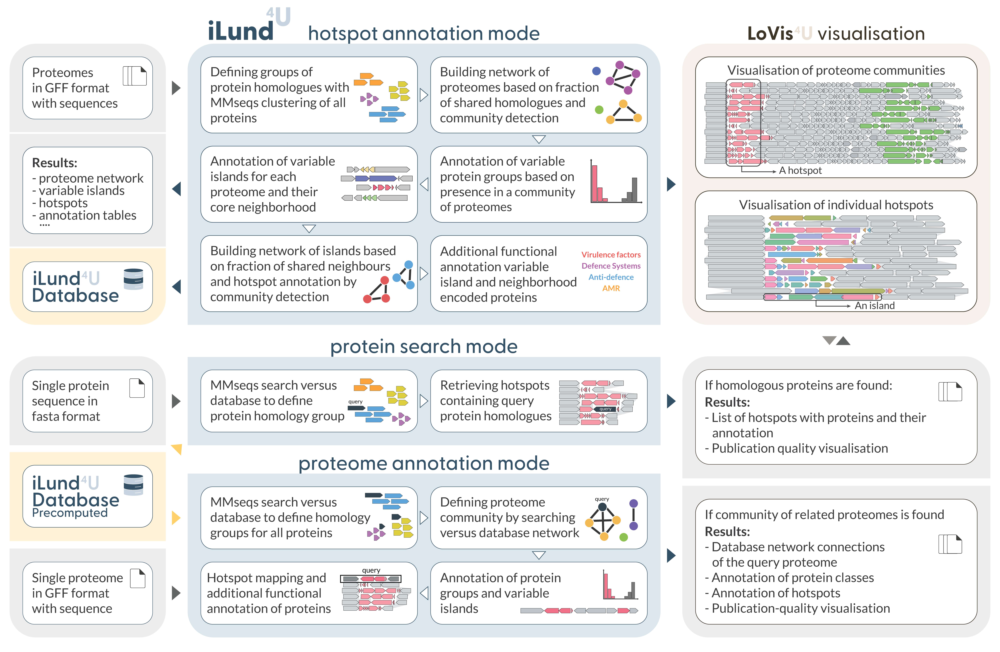

# {loading=lazy width="265" }  

## Description

**iLund4u** is a bioinformatics tool for search and annotation of hotspots in a large set of proteomes. 

**Supported input**: gff3 for annotation files (prokka/pharokka generated); fasta for protein sequences        
**Programming language:** Python3   
**OS:** MacOS, Linux  
**Python dependencies:** biopython, bcbio-gff, scipy, configs, argparse, pandas, matplotlib, seaborn, progess, leidanalg, igraph. pyhmmer, msa4u, lovis4u    
**Python version:** >= 3.8  
**OS-level dependencies:** MMseqs2 (included in the package)  
**License:** WTFPL  
**Version:** 0.0.8 (November 2024)


## Workflow

{loading=lazy width="100%" }  


### What you can do with iLund4u

- Cluster up to millions of genomes based on proteome composition similarity
- Annotate core and accessory genes within each cluster
- Identify and annotate genomic islands
- Annotate the functions of accessory proteins encoded within islands
- Cluster genomic islands to identify variability hotspots
- Get visualisation of clusters and hotspots with our [LoVis4u library](https://art-egorov.github.io/lovis4u/)


## Installation 

- iLund4u can be installed directly from pypi:

```
python3 -m pip install ilund4u
```

- The development version is available at github :

```
git clone https://github.com/art-egorov/ilund4u.git
cd ilund4u
python3 -m pip install --upgrade pip
python3 -m pip install setuptools wheel
python3 setup.py sdist
python3 -m pip install .
```

**!** If you're a linux user, run `ilund4u --linux` post-install command once to update paths in the premade config files that set by default for MacOS users.

## Databases


<p></p>
{ align=right loading=lazy .responsive-image1 }  

iLund4u has two precomputed databases of hotspots built on phage and plasmid sequences.  
The database of phages was built based on running hotspot annotation mode on all available [PhageScope database](https://phagescope.deepomics.org) sequences (~870K genomes, version of September 2024). For plasmids database we took [IMG/PR database of plasmids](https://genome.jgi.doe.gov/portal/IMG_PR/IMG_PR.home.html) (~700K sequences, version of June 2024).  

<div style="clear: both;"></div>


To download iLund4u database from [our server](https://data-sharing.atkinson-lab.com/iLund4u/) you can use the following argument: `--database <phages|plasmids>`. For example, to get plasmids database you need to run:  
```
ilund4u --database plasmids
```

**Database sizes (compressed):** Phages: 6.48GB; Plasmids: 1.07GB 


## Reference 

If you find iLund4u useful, please cite:  
Artyom. A. Egorov, Vasili Hauryliuk, Gemma C. Atkinson, **Systematic annotation of hyper-variability hotspots in phage genomes and plasmids**, *bioRxiv 22024.10.15.618418; doi: [10.1101/2024.10.15.618418](https://doi.org/10.1101/2024.10.15.618418)*

## Contact 

Please contact us by e-mail _artem**dot**egorov**AT**med**dot**lu**dot**se_ or use [Issues](https://github.com/art-egorov/ilund4u/issues?q=) to report any technical problems.  
You can also use [Discussions section](https://github.com/art-egorov/ilund4u/discussions) for sharing your ideas or feature requests! 

## Authors 

iLund4u is developed by Artyom Egorov at [the Atkinson Lab](https://atkinson-lab.com), Department of Experimental Medical Science, Lund University, Sweden. We are open for suggestions to extend and improve iLund4u functionality. Please don't hesitate to share your ideas or feature requests.
